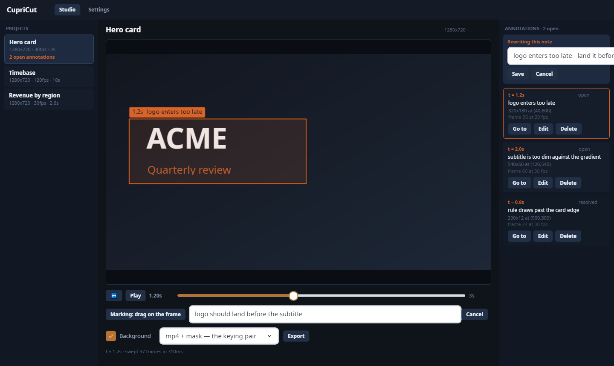
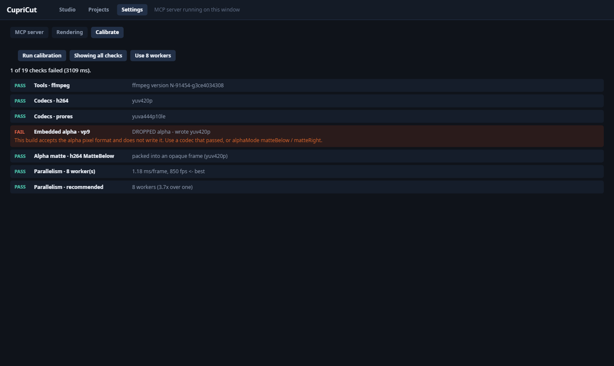
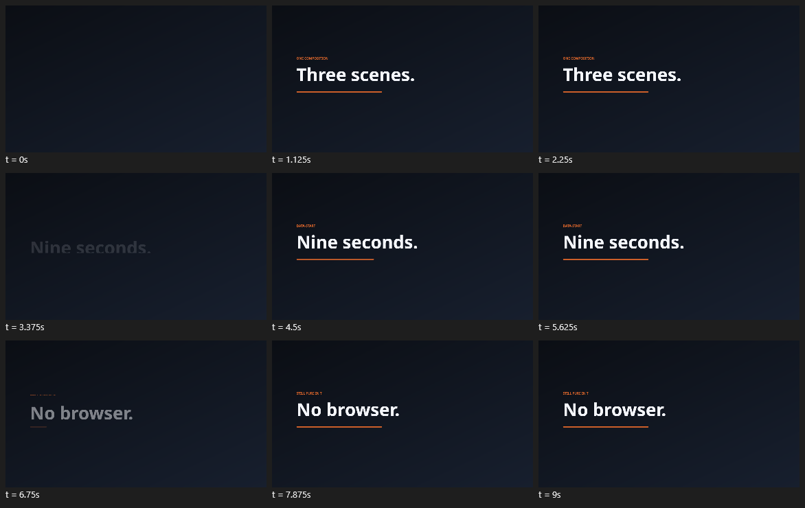
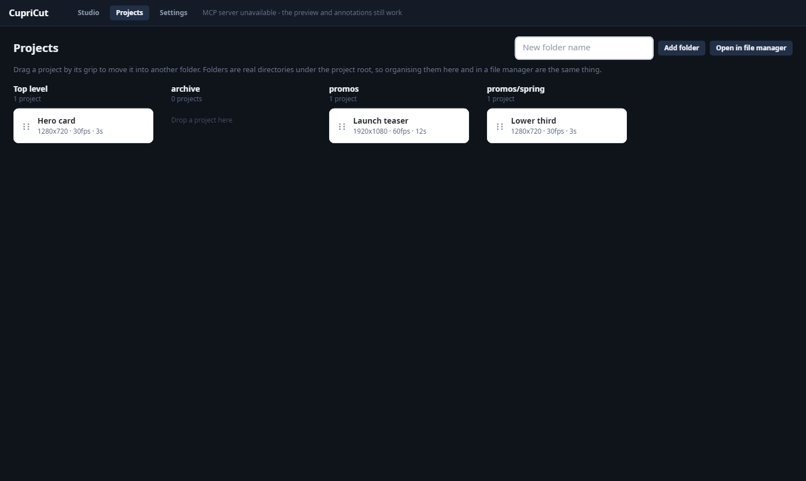

# CupriCut

**Write HTML, render video. No browser.**

CupriCut renders an HTML + CSS composition to frames — and to an MP4 — by driving the
[CupriFace](https://github.com/Wixely/CupriFace) engine's clock directly. It is built for agents:
the first tool returns a *picture*, because the loop an agent actually runs is look, adjust, look.

It exists because of one property of the engine underneath it. **Time is an argument.**
`doc.Animate(t)` drives keyframes, transitions and every other animated thing, and the only
`Stopwatch` in the engine is for profiling. A renderer that wants frame 45 asks for frame 45.

The comparable tool, [hyperframes](https://github.com/heygen-com/hyperframes), seeks a headless
Chrome frame by frame into FFmpeg and has to build "seekable" adapters to approximate what this gets
for nothing. CupriCut needs no browser at all.

> **Status: Milestone 1 + 1b are in.** The renderer, the MCP server, the CLI, the project file and
> the Docker image all work: `render_frame`, `contact_sheet`, `render_frames`, `render_video`,
> `export`, `probe`, `list_fonts`, and the five project tools. Still to come are the timeline layer
> (`data-start` / `data-duration`), `inspect`, `lint` and the interaction track — see
> [PLAN.md](PLAN.md) for the build order and [docs/SCOPE.md](docs/SCOPE.md) for the reasoning and
> the measurements behind it.

---

## Measured before any of it was written

On the engine as it stands, rendering the CupriFace Showcase's Motion page — looping `@keyframes`
plus transitions — at 940×720, CPU, headless, on a laptop:

| | |
|---|---|
| render only, sweeping one document | **179 fps** — 5.6 ms/frame |
| the same sweep run twice | **byte-identical** |
| the same `t` from a separate document instance | **byte-identical** |
| 3 s / 90 frames to MP4, raw RGBA piped to ffmpeg | **0.74 s**, 181 KB, h264 30 fps |
| a PNG sequence | 45.6 ms/frame — the **encoder** is the cost, not the render |

And one measurement that shapes the whole tool surface:

| | |
|---|---|
| a frame at `t` re-rendered **after seeking away** | **differs**, on a composition that uses transitions |
| a forward sweep vs a fresh document at each `t` | **1 of 45 frames matched** |
| a fresh document per frame | 87 ms/frame — **15.7×** the cost of sweeping |

**The engine is reproducible, but a frame is not a pure function of `t`.** It is a function of `t`
*and the frames rendered before it*: transitions, toasts, reorder easing and overscroll interpolate
from what the last frame held. Both strategies repeat perfectly; they simply disagree with each
other.

So "the frame at `t`" needs one definition — but **only for compositions that carry state between
frames.** `@keyframes` does not. Measured on the three worked compositions here, a direct render is
**byte-identical** to a swept one and 10–45× faster, so CupriCut decides per composition:

| | |
|---|---|
| **pure in `t`** — no transitions, toasts or scroll | rendered directly. One frame costs one frame. |
| **not pure** | swept from 0, because a transition interpolates from whatever the last frame held |

The analysis is conservative: anything unrecognised counts as impure, because a false "pure"
renders the wrong frame silently while a false "impure" only costs time. `--force-sweep` overrides
it for proving a difference.

What that is worth: scrubbing to `t = 9` in a 120 fps project was 1080 frames and 8.6 s. It is now
one frame.

## What it will promise about determinism

**Identical pixels on any machine of one OS. Identical layout on all three.**

Not "render on Linux, reproduce on a Mac". That narrower claim is not a guess — CupriFace built a
cross-platform text gate to prove the wider one and the gate returned three distinct pixel hashes,
because Skia rasterises glyphs through FreeType on Linux, DirectWrite on Windows and CoreText on
macOS. What is guaranteed everywhere is the same advances from the same font bytes, so the gate
compares a *layout* hash across the three and reports pixel hashes without comparing them.

For a renderer that is still the useful guarantee: a CI runner and a developer laptop of the same OS
agree byte for byte. Fonts must be registered rather than resolved from the machine, which is what
`FontPolicy.RegisteredOnly` is for, and CupriCut will set it.

## Shape

A standalone Streamable-HTTP MCP server in the same house style as `GithubMCPSharp`, plus a thin
`cupricut` CLI over the same services, because a CI job is not an MCP client.

| tool | does | state |
|---|---|---|
| `render_frame` | one PNG at `t`, swept from 0 so it matches the video | **in** |
| `contact_sheet` | N frames tiled into one timestamped PNG — an agent reads one image and sees a whole motion | **in** |
| `render_frames` | the image sequence, encoded on the thread pool | **in** |
| `render_video` | raw RGBA into ffmpeg; `alpha` gives a transparent clear, embedded or as a matte | **in** |
| `export` | a LIST of outcomes — mp4, h265, webm, mov, gif, frames, mask, matte — all from one sweep | **in** |
| `list_formats` | what each format gives you, for choosing between them | **in** |
| `inspect` | the timeline as data — tracks, windows, events, assets, and every font asked for | **in** |
| `analyse_audio` | where the hits are in a track: onsets, a tempo grid, sound boundaries, a loudness envelope | **in** |
| `attach_audio` | store those cues in a project, with the track and a hash of it | **in** |
| `render_video` / `export` | …and mux it into the finished file, except where it does not belong | **in** |
| `analyse_video` | where the cuts are in footage, and where it is calm enough to put words over | **in** |
| `analyse_video` | where the cuts are in footage, and where it is calm enough to put words over | **in** |
| `lint` | will it render the same somewhere else, and does it render what you meant | **in** |
| `probe` | whether ffmpeg answers, which codecs, what the limits are | **in** |
| `list_fonts` | what is registered, and what each family a composition asked for resolved to | **in** |
| `calibrate` | what this ffmpeg can really do, and the fastest render parallelism | **in** |
| `save_project` / `load_project` / `update_project` / `list_projects` / `attach_asset` | the work, in a file a later run can reopen | **in** |
| `move_project` / `create_folder` | projects in folders, which is the difference between three projects and thirty | **in** |


Compositions are plain HTML + CSS in the engine's documented subset. Timeline attributes —
`data-start`, `data-duration`, `data-track`, borrowed from hyperframes on purpose so the agents and
skills that already know them transfer — arrive with Milestone 2.

## Projects: the work survives the session

A `.cut.json` project is one self-contained file holding the HTML, the CSS, the render settings
that regenerate the animation, any assets inlined as `data:` URIs, and free-text notes. It exists
so a **second** run — a different session, no shared context, possibly no filesystem tool at all —
can `load_project`, read what the first one was thinking, change one rule with `update_project`,
and render it again at the same size and rate without being told any of it.

A project *is* a composition: pass its name wherever an `.html` file is asked for, and everything
you leave out comes off its `render` block.

```
save_project(name: "hero", html: "...", css: "...", width: 800, height: 450, fps: 25, duration: 2)
   → projects/hero.cut.json

# …a week later, a different run:
load_project(name: "hero")            → the HTML, the CSS, the settings, the notes
update_project(name: "hero", css: "…") → only the stylesheet changes
render_video(composition: "hero.cut.json")  → 800×450 at 25 fps for 2 s, because the project said so
```

## Running it

```bash
# The CupriFace package comes from GitHub Packages, which will not serve even a public package
# anonymously, so this is needed once per machine.
dotnet nuget update source GitHub-Wixely-Packages   --username <your-github-username>   --password <a PAT with read:packages>   --store-password-in-clear-text

dotnet build
dotnet test
dotnet run --project CupriCut.csproj      # studio window + MCP server
dotnet run --project CupriCut.csproj -- -c   # headless: MCP server only
```

**Two faces, one binary.** `CupriCut` opens the studio window by default and `-c` runs headless —
and **both host the MCP server**. The window is a second face on the same service, never a separate
app. A Windows Service or a container implies `-c`, and a window that cannot open falls back to
serving headlessly rather than taking the server down with it. A failed port bind does not cost the
window either: the preview and annotations still work, and the status strip says the server is
unavailable.

| flag | |
|---|---|
| *(none)* | studio window + MCP server |
| `-c` / `--console` | headless: MCP server only |
| `--software` | force the software renderer — run this before assuming a missing window is a broken app |
| `--Server:Port=5723` | a second instance beside a running one |

VS Code launch configurations for all of these are in [.vscode/launch.json](.vscode/launch.json);
**Studio (desktop)** is the default, so F5 opens the window.

The CLI has the same verbs over the same services:

```bash
cupricut probe
cupricut frame  --composition title-card.html --t 1.2
cupricut sheet  --composition stat-counter.html --duration 3 --count 9
cupricut video  --composition lower-third.html --duration 3 --codec h264
cupricut video  --composition timebase.html --duration 10 --fps 120   # 1200 frames, 10.000s
cupricut projects
```

### Writing one

**[docs/AUTHORING.md](docs/AUTHORING.md)** is the guide: what animates and what silently does not,
the one-animation-per-element rule, the `calc()` that is treated as zero, the timeline and event
vocabulary, and a checklist to run before calling a composition finished.

Every claim in it is asserted in `AuthoringGuideTests`, because a guide to *silent* behaviour is
worthless the moment it goes stale — and it goes stale without anyone finding out.

### The compositions that ship

Ten of them, in `compositions/`. Each is a working starting point and each exists to show one thing:

| | what it is for |
|---|---|
| `lower-third.html` | The broadcast staple, and the **marked backdrop**: one file gives an opaque clip to review and a transparent one to key. |
| `title-card.html` | **Staggering.** Four elements, one `@keyframes`, four `animation-delay`s. Design tokens as `:root` custom properties. |
| `revenue-card.html` | **A chart that draws itself**, bar by bar, on nothing but delays. |
| `stat-counter.html` | **Sequencing.** Nothing happens at once: the card lifts, the bar draws, the number lands *on* the bar finishing, the caption follows. Order is the design. |
| `caption-strip.html` | **The keying workflow**, end to end — a small overlay with nothing behind it, and a review backdrop that the export drops automatically. |
| `scenes.html` | **The timeline.** Three scenes over nine seconds — `data-start`, `data-duration`, and a late scene giving its children their own zero. |
| `timebase.html` | The frame-accuracy proof: a clock that reads its own frame number, for checking 1200 frames really are 10.000 seconds. |
| `countdown.html` | **A counting clock with no clock.** Ten seconds, eleven divs, no logic: each number is on screen for exactly one second because `data-start` says so. Frame-exact in a way a scripted timer is not. |
| `bar-race.html` | **Data that moves.** Four ranked bars with the lead changing hands — the overtake is three shapes in one `@keyframes`, because one element gets one animation. The moment the lead changes is declared as an event, because nothing in the render could tell you when two widths cross. |
| `fixture-card.html` | **A composition that is really a template**, and the **events** example. Two timeline scenes and a price that shortens; the markup never moves, only the text and the figures. The shape you actually ship. |

Every one is pure in `t`, so every one renders directly rather than being swept.

Docker is the one departure from house style — **the image carries ffmpeg**, because a container
whose job is turning HTML into MP4 and which then cannot encode one is broken. The release zips do
not; `Cut:FfmpegPath` names it and `probe` says whether it answered.

```bash
# The token goes in as a BuildKit secret, so it never reaches an image layer or `docker history`.
export GITHUB_TOKEN=<a PAT with read:packages>
docker build --secret id=NUGET_AUTH_TOKEN,env=GITHUB_TOKEN -t cupricut .

docker run --rm -p 5722:5722   -v "$PWD/compositions:/app/compositions:ro"   -v "$PWD/projects:/app/projects"   -v "$PWD/output:/app/output"   cupricut
```

## The studio window: point instead of describing

The loop is look, adjust, look — and until the window, only the agent got to look. A reviewer had to
open a PNG somewhere else and then put the problem into prose.



The **Settings** page has three tabs — the MCP endpoint with copyable URLs, the paths and render
settings in force, and **Calibrate**, which runs the capability checks and the parallelism benchmark
in the window, shows the failures, and **saves the measured worker count** when you take it:



Pick a project, **play it in real time**, scrub to a frame, drag a box round what is wrong and type
a sentence. The window holds the composition open between frames — opening and settling costs
25–370 ms, the frame itself 3–7 ms — so playback runs at 144–296 fps of headroom against a 30 fps
clock. The agent then reads the annotation back:

```
list_annotations(project: "review")

  [ad54d3d2] t=1.2s  512x180 at (64,216) of 1280x720  "logo enters too late and sits too far left"
  see it with: render_frame(composition: "review.cut.json", t: 1.2)

resolve_annotation(project: "review", id: "ad54d3d2",
                   resolution: "moved the logo keyframe from 1.2s to 0.6s")
```

### Will it render the same somewhere else?

```
$ cupricut lint --composition promo.html
error   CF0030 (line 1):  is not something the engine draws - it lays out, and then stays empty.
        -> Use <cupri-image src="..."> - the engine has no raw  primitive.
warning CUT001: 'Helvetica Neue' was answered by Arial (System), not by a registered file.
        -> Put the face in a Cut:FontDirectories folder, or name a family that is registered.

promo.html: 1 error(s), 1 warning(s).
```

Three sources in one verdict. The engine's own reader (`CF*`) catches the silent things - a tag that
never closed, a component nothing registered, a CSS property it ignored. CupriCut adds what only it
knows (`CUT*`): a font answered by the **machine** rather than by a registered file, a resource that
never arrived, a timeline it could not make sense of. Being impure in `t` is reported as **info, not
a fault** - it is correct and slower, and calling it an error would be a lie. The CLI exits non-zero
only on errors, which is what a CI step gates on.

`cupricut inspect` is the same look asked the other way: the timeline as data, plus the assets and
every font family the composition asked for and what answered it.

### A composition can be a sequence

`data-start` and `data-duration` say when an element is on screen. Nine seconds, three scenes:



Nothing is added to or removed from the document per frame — that would mean reloading it, at
25–370 ms against 3–7 ms for a frame. Each timed element gets a generated `@keyframes` that holds it
at `opacity: 0` outside its window and `1` inside, with **adjacent stops** so the change is a cut
and not a fade. `Animate(t)` does the rest, and a composition with a timeline is **still pure in
`t`** — so it still renders directly.

Two rules, both the engine's rather than choices, and both discovered by measuring:

- **A timed element's own `animation` belongs to CupriCut.** The engine runs exactly one animation
  per element — comma-separated lists do nothing, in either the shorthand or the longhand form — so
  the window and an author's animation cannot share one. Put the motion on a child. A violation is
  reported rather than silently eating the animation.
- **A late scene needs `var(--cut-start)`.** The clock is absolute and stamps no creation time, so a
  child of a scene appearing at 3s would otherwise have played its entrance at 0 and be sitting
  still by the time you saw it. Each scene publishes `--cut-start`, custom properties inherit, and a
  child writes `animation-delay: var(--cut-start)`. Look at the sheet above: scenes two and three
  are caught mid-entrance, which is that working.

`calc(var(--cut-start) + 0.2s)` is the obvious next thing to want and does **not** work — `calc()`
is not supported in `animation-delay` at all. Stagger inside a scene goes in the keyframe
percentages instead.

### Events: the composition says when, you decide what

Something has to happen halfway through an animation. `data-cut-event` declares the moment:

```html
<div class="scene" data-start="6" data-duration="6" data-track="card"
     data-cut-event="+0.5:boost-shown; +2.4:boost-landed">
```

A render writes them out beside its own output as `<name>.events.json`, with the frame each one
lands on **at the rate that render used**:

```json
{ "composition": "fixture-card.html", "fps": 30, "duration": 12,
  "events": [
    { "name": "boost-landed", "at": 8.4, "frame": 252, "element": "div.scene", "track": "card" }
  ] }
```

`inspect` lists the same marks, and `lint` reports one it cannot read or one nothing will ever
reach. A `+` time is an offset from the element's own `data-start`, so marks move with their scene
instead of having to be recalculated when it does.

**They are declared and reported, never executed** — and that is the design, not a shortcut. The
obvious version is a callback the engine fires as the clock passes a mark, and it cannot work here,
because **nothing plays: a render seeks.** Frames come out of `Animate(t)` in whatever order and at
whatever granularity the sweep chooses, workers render different stretches of the same film at the
same time, a re-render of one bad second starts at `t=4.0`, and a composition that is pure in `t`
is never swept at all. A callback would fire out of order, fire repeatedly, or never fire. (The
same is true upstream, which is why HyperFrames' own render path has no such hook either.)

A number and a name in a file has none of those problems. It is right under every one of those
cases because it is not tied to the traversal, it **survives the render** — the output is a file,
and the file is what gets used later — and the thing acting on it is a program you already control.

It also costs the render nothing: an event changes no rendering decision, so a composition that
declares fifty of them is still pure in `t` and still renders every frame directly.

### Two shapes for a project

`.cut.json` is a project: HTML, CSS, the render settings, annotations, and any assets inlined as
`data:` URIs — one readable, diffable file you can hand to another machine.

That works until audio. Base64 adds a third to something already large, and four minutes of WAV
inlined is a JSON file no editor will open. So there is a second shape:

```
hero.cutpkg                     a zip
├── project.json                the same schema, assets pointing at entries
└── assets/
    └── theme.mp3               stored as bytes
```

**The manifest is the same format.** Loading either produces the same object, so nothing
downstream — render, `lint`, the studio, annotations — knows or cares which it came from. There is
a test that renders both and compares the pixels.

**The extension decides, never a size.** `hero.cut.json` writes JSON; `hero.cutpkg` writes a
package. An automatic switch past some megabyte count would be a threshold nobody can see. A
package is also read for what it *is* rather than what it is called, so a renamed one still opens.

Measured on a 200 KB incompressible payload: **267 KB as JSON, 201 KB as a package** — the base64
tax gone, and already-compressed formats stored rather than pointlessly deflated.

### Timing motion to a track

```
$ cupricut audio --audio theme.wav --fps 30 --kind downbeat
theme.wav  12s at 30 fps (360 frames)
  128.02 BPM, confidence 1.00 - beats emitted

onset 25   beat 19   downbeat 7   soundstart 0   soundend 0

      time  frame   kind        strength  snap
     0.267s      8  Downbeat        0.99   -11.8ms
     2.167s     65  Downbeat        0.80    13.5ms
     4.033s    121  Downbeat        0.45     5.4ms
```

Every cue carries the **frame** it lands on, because a frame is the smallest thing a render has —
a title landing on frame 65 is `animation-delay: 2.167s` at 30fps. The distance each cue moved to
reach its frame is reported rather than absorbed, the same rule clip lengths already follow.

**The agent writes the keyframes.** There is no `data-cut-cue` binding and there may never need to
be: the round trip through whatever is composing is already short, and it keeps the timing where
the judgement is. Ask for the cues, write the delays.

**Do it once.** `attach_audio` stores the cues in the project along with the track and a hash of
it, so `load_project` hands them back for free from then on:

```
$ cupricut audio --audio theme.wav --project hero --as hero.cutpkg
  stored in .../projects/hero.cutpkg (107,059 bytes, track included)
```

Stored rather than re-read for the same reason everything else here is pinned: a render has to be
reproducible on a machine with a different ffmpeg, and audio analysis drifts between versions — a
cue that moves by a frame between two machines is the class of bug this project exists to avoid.

**The hash is why storing it is safe.** Replace the track without re-reading it and `lint` says so
(`CUT008`), instead of you finding out when an animation no longer lands on anything.

That twelve-second track is **2,830,778 bytes inlined in a `.cut.json` and 107,059 as a package** —
which is what `--as hero.cutpkg` is for, and the moment a project first has a reason to become one.

**And then it comes out in the render.** `video` and `export` mux the project's track into the
file, or take one by name:

```
$ cupricut export --composition hero.cutpkg --formats mp4,mask,gif --alpha
  mp4     hero_mp4.mp4    22,008 bytes  yuv420p     <- aac
  mask    hero_mask.mp4    5,608 bytes  yuv420p     <- silent
  gif     hero_gif.gif     4,620 bytes  bgra        <- silent
```

One sweep, three files, audio only where it belongs. **A matte or a mask never carries sound** — it
is half of a pair whose other half does, and doubling the bytes would desynchronise whoever
assembles them later. Nor does a GIF, whose container has no audio stream at all. The answer names
which files got it and which did not, because a silent half is exactly where correct looks broken.
`--no-audio` renders silent regardless.

The audio codec follows the **container**, not a preference: WebM takes only Vorbis or Opus and
refuses AAC outright. And the mux is **verified, not assumed** — the finished file is probed and a
dropped stream is an error, the same rule alpha has followed from the start.

**Read the confidence.** Beat detection is good on percussive material and unreliable on everything
else, so below 0.35 no beats are emitted at all — only onsets and sound boundaries, which are the
dependable half. Sound boundaries are usually what a lower third actually wants anyway.

The analysis is in-process — an FFT, a spectral flux, an adaptive threshold, an autocorrelation and
a least-squares fit, about 400 lines. Not to avoid a dependency for its own sake, but because a
library whose version changes the answer makes a render irreproducible in exactly the way this
project refuses everywhere else. ffmpeg does the decoding, since it is already here and already
reads everything.

### Reading the footage underneath

The opposite problem to timing motion to music: keeping a caption off a cut.

```
$ cupricut footage --video clip.mp4 --calm 1.5
clip.mp4  7s at 30 fps (210 frames)
  2 cut(s), average motion 0.005, average luminance 0.234

CALM  start a 1.5s caption at 0s (frame 0), motion 0.000 - no cut inside it

      time  frame   strength
         2s     60       1.00
         5s    150       0.92
```

Same cue shape as the audio — a time and the frame it lands on — so nothing acting on one needs to
learn a second vocabulary. `--calm N` asks the question you actually have: *where do I put a caption
that is on screen for N seconds?* **It will never answer with a window that straddles a cut**, since
a caption that begins over one shot and ends over another is worse than one placed badly.

Luminance comes back too, for deciding whether the text over it should be light or dark.

Measured in-process from **32×18 greyscale frames** — ffmpeg decodes, everything else is arithmetic
here. Not ffmpeg's own `scdet`, for the reason the audio analysis is in-process too: a filter whose
threshold behaviour changes between builds makes a render irreproducible. At 576 pixels a cut still
changes nearly everything at once while a pan, however fast, changes it gradually — and throwing
the detail away removes exactly the grain and compression noise that makes full-resolution
differencing jumpy.

### Reading the footage underneath

The opposite problem to timing motion to music: keeping a caption off a cut.

```
$ cupricut footage --video clip.mp4 --calm 1.5
clip.mp4  7s at 30 fps (210 frames)
  2 cut(s), average motion 0.005, average luminance 0.234

CALM  start a 1.5s caption at 0s (frame 0), motion 0.000 - no cut inside it

      time  frame   strength
         2s     60       1.00
         5s    150       0.92
```

Same cue shape as the audio — a time and the frame it lands on — so nothing acting on one needs to
learn a second vocabulary. `--calm N` asks the question you actually have: *where do I put a caption
that is on screen for N seconds?* **It will never answer with a window that straddles a cut**, since
a caption that begins over one shot and ends over another is worse than one placed badly.

Luminance comes back too, for deciding whether the text over it should be light or dark.

Measured in-process from **32×18 greyscale frames** — ffmpeg decodes, everything else is arithmetic
here. Not ffmpeg's own `scdet`, for the reason the audio analysis is in-process too: a filter whose
threshold behaviour changes between builds makes a render irreproducible. At 576 pixels a cut still
changes nearly everything at once while a pan, however fast, changes it gradually — and throwing
the detail away removes exactly the grain and compression noise that makes full-resolution
differencing jumpy.

### Projects live in folders



Folders are columns, projects are cards, and a card is dragged between them by its grip. A folder is
just a directory under the project root — not an index, not a field in a file — so organising them
here and organising them in a file manager are the same act, and neither can get out of step with
the other. `move_project` and `create_folder` do the same from an agent.

Dragging a file **in from the desktop** does not work, and is not pretended to: the window host has
no file-drop support, so there is nothing to hook. **Open in file manager** is the substitute, and
it is one click.

Annotations are stored **in the project**, because that is already the file a later run opens, and
in **normalised 0–1 coordinates**, so a note drawn on a 1280×720 preview still means the same region
when the project renders at 3840×2160.

**You can see what you marked.** The rectangle is drawn *into* the frame, not layered over it — it
is in frame coordinates, and that is the only space it means anything in, so there is one mapping
rather than two that can drift apart:


A mark stays on screen for a **full second after its timestamp**, so it can be found by scrubbing
rather than by landing on the exact frame; the selected one is picked out, resolved ones are muted,
and notes belonging to another moment are simply not drawn. While dragging, a dashed marquee follows
the pointer with the pixel size read out beside it. Notes are editable after the fact, and choosing
one jumps the preview to its moment.

Each note also records the **frame number at the rate it was made at** — stamped, not derived on
read, so changing the project's fps later cannot silently renumber what the reviewer actually saw.

### One render, every format you need

`export` takes a list of outcomes rather than a codec argument:

```
cupricut export --composition lower-third.cut.json --formats mp4,mask,gif,frames --no-background

  mp4     mp4.mp4              26,135 bytes  yuv420p
  mask    mask.mp4              8,677 bytes  yuv420p
  gif     gif.gif              90,110 bytes  bgra
  frames  frame_%05d.png      875,075 bytes  rgba
```

Four files, **one sweep**. A frame written to four pipes costs no more to produce than a frame
written to one, and rendering is what a clip costs — so the second format is very nearly free.

Sharing the render means sharing its alpha, which is exactly what the useful pair needs. With alpha
on, a format that cannot carry an alpha channel keeps the straight colour and goes black where
nothing was drawn; the mask is the alpha alone. That is the colour-and-matte pair every editor keys:


Asking for a mask *is* asking for a transparent render, so it is inferred rather than demanded
twice. An explicit `alpha:false` beside one is a contradiction, and is refused.

### Render it bigger without re-authoring it

Both of these are 3840×2160 from the same 1280×720 composition. The top one is the default;
the bottom is what "just render it at 4K" actually does:


Laying a 1280-wide design out in a 3840-wide viewport **reflows** it — the lower third stays 584 CSS
pixels and becomes a badge in the corner. Scaling keeps the composition and makes it bigger. So an
output size and a scaling mode are project data:

```
cupricut frame --composition lower-third.cut.json --output-width 3840
```

Name one side and the other follows from the design's aspect. Five modes: **`fit`** (the default —
scale the design to fit, letterboxed if the aspects differ), `responsive` (lay out at the output
size and reflow), `fixed` (1:1, centred), `hybrid` (zoom the tight axis, reflow the long one) and
`adaptive` (hybrid above the design size, responsive below). When the aspects match they agree; the
mode only decides what to do with the surplus.

`fit` is ours; the other four are the engine's `PresentInfo` strategies, used rather than
re-derived. The engine has no letterbox, deliberately — a window host reflows the loose axis
instead, because bars in an application are a bug. A frame of video is not a window.

### The backdrop is a flag, not a second file

The same composition is wanted two ways: over its own background for review, where someone has to
judge the colours against something, and over nothing for the edit. Authoring that twice means two
files that drift. Mark the backdrop instead:

```html
<div --cupricut-background="studio gradient" class="backdrop"></div>
```

and turn it off per render — `showBackground:false`, `--no-background`, or the checkbox in the
window. Every render answer says what the marked backdrop did, so "I asked for no background and
got one" has an answer.

The mechanism was measured rather than assumed, and the obvious one does not work: the engine parses
the attribute perfectly, but a CSS attribute selector on it matches nothing and fails **silently**.
An inline `display:none` works, and beats an author's own `display` rule — which is what makes it
safe to apply to markup CupriCut did not write.

Built on **CupriFace 0.25.0**. The GUI is itself a `CupriApp` — CupriCut's interface is drawn by the
engine CupriCut renders with.
That is why it was cheap: the preview is an `ISurfaceSource`, the seam the engine already has for
live pixel producers, so it costs no PNG encode; and the region drag is `OnPointer`, the same one a
pinch gesture uses. Nothing here needed an engine change.

## Transparency

`alpha: true` clears the frame to transparent. How that reaches the file is `alphaMode`:

| mode | what you get | codecs |
|---|---|---|
| `embedded` *(default)* | a real alpha channel | **vp9**, **prores** only |
| `matteBelow` | one opaque frame of twice the height: colour on top, alpha as greyscale below | **any**, h264 included |
| `matteRight` | the same, side by side | **any** |

**H.264 has no alpha channel** — not in Baseline, Main or High, and no pixel-format argument
invents one. Asking for `embedded` alpha on h264 is refused, and it names both ways out. A matte is
how h264 carries transparency, and it is what web players do for Safari: composite with
`colour x alpha` (the colour half is straight, not premultiplied).

```bash
cupricut video --composition logo.html --alpha --alpha-mode matteBelow --codec h264
#  → 1280x1440 h264, yuv420p. Recompose:
#    ffmpeg -i out.mp4 -filter_complex #      "[0:v]crop=1280:720:0:0[c];[0:v]crop=1280:720:0:720,format=gray[a];[c][a]alphamerge" out.png
```

### `calibrate` — what this machine actually does

```
$ cupricut calibrate
Embedded alpha
  [ ] vp9  DROPPED alpha - wrote yuv420p
      -> This build accepts the alpha pixel format and does not write it.
         Use a codec that passed, or alphaMode matteBelow / matteRight.
1 of 19 checks failed (3109 ms). Pass all:true to see the rest.

Best render parallelism: 8 workers.
```

It encodes a two-frame clip per codec and per alpha mode **with the real arguments CupriCut
issues**, then probes what came out — and times a short render at every plausible worker count.
Failures only by default; `--all` for the whole table.

**A measurement you have to hand-edit into a config file is most of a feature**, so `--apply` saves
it — and so does the button in the window, and `apply:true` on the MCP tool. It writes one key to
`CupriCut.Local.json`, the per-machine layer, which every host loads with `reloadOnChange`: the
running process picks it up without a restart, and so does every run after. Nothing else in that
file is touched, and a file that is not valid JSON is refused rather than overwritten.

Both things it checks exist because they were assumed and were false: vp9 accepts `yuva420p` and
writes `yuv420p`, and `Environment.ProcessorCount` was the *slowest* parallelism on this machine.
Neither was discoverable by reading anything.

**The result is verified, not assumed.** Choosing an alpha-capable codec is not the same as getting
alpha out the other end: measured on ffmpeg N-91454, libvpx-vp9 accepts `-pix_fmt yuva420p`, reports
success and writes plain `yuv420p`. CupriCut now probes the finished file and fails loudly if the
alpha it was asked for is not there — the file is left in place so you can see for yourself.

## Safety, for a tool that writes files

A GitHub server is read-only by default. A renderer's risk is the mirror image, so the boundaries
are about writing:

| setting | default | is |
|---|---|---|
| `Cut:CompositionRoots` | `compositions` | the only directories compositions, stylesheets, images and fonts are **read** from |
| `Cut:OutputRoot` | `output` | the only directory PNGs and videos are **written** to |
| `Cut:ProjectRoot` | `projects` | the one **read-write** directory, and only `.cut.json` may land in it |
| `Cut:MaxFrames` | `0` | **no limit.** Set it only to bound what one caller can spend on a shared instance |
| `Cut:MaxPixels` | `8294400` | ceiling on pixels per frame, after `scale` (3840×2160). A single huge *frame* is a different question from a long *clip* |
| `Cut:EnableVideo` | `true` | off means PNG only, ffmpeg never launched |

### `duration` and `to` differ by one frame, on purpose

`duration` is a **length**: `duration x fps` frames covering `[from, from+duration)`. `--duration 10
--fps 120` is 1200 frames and a file ffprobe reports as exactly `10.000000`. `to` is an **inclusive
endpoint** and keeps the frame at `t=to`, which is one frame more — right for sampling, wrong for a
clip length, and the reason a renderer that conflates them quietly overruns. A project's `duration`
is a length. Naming both is refused rather than resolved.

### A length that isn't a whole number of frames always says so

A clip is frames, so its length is quantised to `1/fps`. Ten seconds at 120 fps lands exactly;
ten seconds at 29.97 fps is 299.7 frames, and there is no such thing. CupriCut takes the **nearest
whole frame** and **always reports the difference** — absorbing it silently is how someone finds
out much later that their ten-second cut is 10.010s.

```
$ cupricut video --composition timebase.html --duration 10 --fps 29.97
output/timebase.mp4  (252,554 bytes, 300 frames, 10.01001s, h264)
duration 10.01001s, asked for 10s (+10.01ms)
  10s at 29.97 fps is 299.7 frames, not a whole number. Snapped to the nearest whole
  frame (300), so the clip is 10.01s (+10.01ms). For exactly 10s, use 30 fps (300 frames).
```

The MCP tools carry the same thing as a `timing` object (`requestedSeconds`, `actualSeconds`,
`frames`, `exact`, `deltaMs`, `note`). When the request lands exactly, `exact` is true and there is
no note.

## Licence

MIT, matching CupriFace. The two Noto Sans faces in `fonts/` are SIL OFL 1.1 — see `fonts/OFL.txt`.
They ship because `FontPolicy.RegisteredOnly` is always on, so a bare install needs at least one
registered family for anything to render at all.
